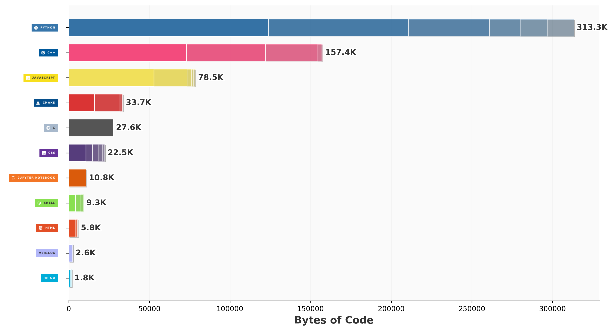

# 👋 Hi, I'm Samuel Oluwaseun Aboderin

**MLH Fellow @ G-Research (PyArrow)** | Computer Engineering Undergraduate @ UNILAG  
*Focused on Low-Latency C++, Systems Programming, and High-Performance Computing (HPC).*

[🔗 LinkedIn](https://www.linkedin.com/in/samuelaboderin/) • [✉️ Email](mailto:aboderinseun01@gmail.com)

---

## 🚀 Technical Focus & Core Pursuits

I build and optimize software where every microsecond, byte of memory, and CPU cycle matters. I thrive closest to the metal, understanding how software behaves under rigid real-world constraints: **latency, reliability, scale, and hardware limits.**

*   **Systems & Data Infrastructure:** Contributing to **PyArrow** via the **MLH Fellowship (in partnership with G-Research)**, focusing on high-performance memory management, columnar data layouts, and ultra-fast serialization.
*   **Low-Latency Engineering:** Actively diving deep into low-level C/C++, custom memory allocators, cache optimization, and mechanical sympathy.
*   **Infrastructure Reliability:** Leveraging Linux internals, low-level networking, and Golang to design highly resilient, high-throughput microservices and automated infrastructure.
*   **Algorithmic Muscle:** Rigorous daily practice in complex Data Structures and Algorithms (DSA) to maintain deterministic, optimal problem-solving instincts.

---

## 🛠️ The Stack

### Systems & Performance Languages

  
  
  
  
  
  

### Hardware & Low-Level Architecture

  
  
  
  
  

### Platform & Infrastructure

  
  
  
  

---

## 📈 Code Metrics

  

> *"The best way to optimize code is to treat memory layouts as physical geometry and clock cycles as currency."*
